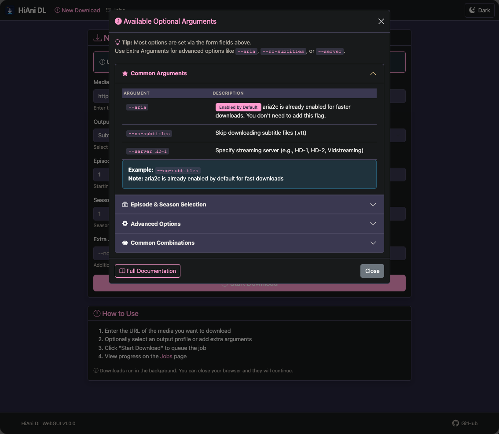

<div align="center">
  

  # <span style="color: #FF9BCF">HiAni DL</span>

  ### Anime Downloader with Modern Web Interface

  
  
  

  **Download anime from HiAnime.to with a beautiful dark-themed web interface**

</div>

> [!IMPORTANT]
> 🎉 **Version 1.0 is Now Live!**
>
> HiAni DL v1.0.0 has been released and is ready for testing! Download the latest Docker image and help us improve the project.
>
> 📦 **[View Release Notes](https://github.com/benjaminmue/HiAni-DL/releases/tag/v1.0.0)** | 📢 **[Read Announcement](https://github.com/benjaminmue/HiAni-DL/discussions/1)** | 🤝 **[We Need Contributors!](https://github.com/benjaminmue/HiAni-DL/discussions/1#user-content-we-need-your-help)**

> [!CAUTION]
> **Known Issues with Multi-Episode Downloads**
>
> This project currently has **reliability issues when downloading multiple episodes**. Downloads may work intermittently - sometimes succeeding, sometimes failing without clear patterns.
>
> **Root Cause:** The current Selenium-based stream capture implementation struggles with parallel episode processing and can hang or fail to extract streams. Initial testing with a Playwright migration did not resolve these issues.
>
> **Recommendation:** For production use, consider downloading episodes **one at a time** or be prepared for occasional failures requiring manual restarts. This project is best suited for **experimental/personal use** until the stream capture logic is stabilized.

---

## 📖 What is HiAni DL?

HiAni DL is a **Docker-only** anime downloader designed for **local network (LAN) use**. It features a modern web interface with real-time progress tracking and background processing.

> 🏠 **LAN-Only Deployment**
> This application is designed for **private home networks only**. Never expose it directly to the internet without proper security measures.

> 🐳 **Docker Required**
> HiAni DL **only runs in Docker** - no standalone Python installation is supported. All dependencies, Chrome, and ffmpeg are included in the Docker image.

**Key Features:**
- 🌐 **Modern Web Interface** - Dark theme inspired by HiAnime.to
- 🎬 **Full Anime Support** - Episodes, seasons, and ranges
- 📊 **Real-time Progress** - Live updates via Server-Sent Events
- 🎯 **Background Downloads** - Continue after closing browser
- 🐳 **Docker-Ready** - Chrome and ffmpeg included
- 🔧 **Unraid Support** - PUID/PGID mapping

---

## 🚀 Quick Start

**New to Docker or HiAni DL?** Follow our step-by-step guide:

<div align="center">

### **[📘 Complete Quick Start Guide](https://github.com/benjaminmue/HiAni-DL/wiki/Quick-Start-Guide)**

Walks you through:

✅ Installing Docker (Windows/Mac/Linux)

✅ Creating your docker-compose.yml

✅ Starting the container

✅ Your first download

**Takes ~10 minutes to get up and running!**

</div>

---

**Already have Docker?** Here's the express version:

```bash
# Create docker-compose.yml with your paths and timezone
docker-compose up -d

# Access WebGUI at http://localhost:8080
```

See the [Quick Start Guide](https://github.com/benjaminmue/HiAni-DL/wiki/Quick-Start-Guide) for the complete docker-compose.yml template.

> 💡 **Pre-built Image:** The Docker image is automatically built and published to GitHub Container Registry as `ghcr.io/benjaminmue/hiani-dl:latest` on every commit to main.

---

## 📚 Documentation

<div align="center">

| Document | Description |
|----------|-------------|
| **[Quick Start Guide](https://github.com/benjaminmue/HiAni-DL/wiki/Quick-Start-Guide)** | Complete installation guide from Docker setup to first download |
| **[User Guide](https://github.com/benjaminmue/HiAni-DL/wiki/User-Guide)** | How to use HiAni DL, select URLs, and manage downloads |
| **[Docker Setup](https://github.com/benjaminmue/HiAni-DL/wiki/Docker-Setup)** | Environment variables, volumes, and configuration |
| **[WebGUI Guide](https://github.com/benjaminmue/HiAni-DL/wiki/WebGUI-Guide)** | Web interface features and usage |
| **[Arguments Reference](https://github.com/benjaminmue/HiAni-DL/wiki/Arguments-Reference)** | Command-line arguments and options |
| **[Security](https://github.com/benjaminmue/HiAni-DL/wiki/Security)** | Security features and deployment guidance |

</div>

---

## 📸 Screenshots

<div align="center">

| Web Interface | Available Arguments |
|---------------|---------------------|
|  |  |

| Job Progress | Job List |
|--------------|----------|
|  |  |

</div>

---

## ⚡ Features

### Web Interface
- 📝 Submit downloads via web form
- 📊 Monitor progress with live updates
- 📜 View job history and detailed logs
- ❌ Cancel running jobs
- 🎨 Beautiful dark theme inspired by HiAnime.to

### Download Options
- Single episodes or full seasons
- Episode range selection (e.g., episodes 1-12)
- Sub or dub selection
- Custom output directory
- Server selection (HD-1, HD-2, Vidstreaming)

### Technical
- Aria2c integration for fast downloads
- Chrome automation with Selenium
- SQLite job database
- Server-Sent Events for real-time updates
- Automatic retry on failure

---

## 🔧 Configuration

**The WebGUI is the default mode and starts automatically with `docker-compose up -d`.**

### Basic Setup (LAN Use)

The default `docker-compose.yml` is pre-configured for home/LAN use:

```yaml
services:
  hianime-webgui:  # Starts automatically (no profile needed)
    image: hianime-downloader
    ports:
      - "8080:8080"
    volumes:
      - /path/to/downloads:/downloads
      - hianime-config:/config
    environment:
      TZ: Europe/Zurich
      URL_ALLOWLIST: "hianime.to"  # Optional for home use
```

### Optional Security

```yaml
environment:
  WEB_USER: admin              # Optional: Enable authentication
  WEB_PASSWORD: your-password  # Optional: Set password
```

### CLI Mode (Advanced)

CLI mode is available but **requires explicit activation**:

```bash
docker-compose --profile cli up -d hianime-downloader
```

See **[Docker Setup](https://github.com/benjaminmue/HiAni-DL/wiki/Docker-Setup)** for complete configuration options.

---

## 📜 Origin

This project is a **disconnected fork** of [HianimeDownloader](https://github.com/gheatherington/HianimeDownloader) by gheatherington. It has diverged significantly with:
- Docker and Unraid support
- Modern web interface with dark theme
- Real-time progress tracking
- Enhanced security features
- Comprehensive documentation

---

## ⚠️ Disclaimer

- **For personal use only** - Respect copyright laws in your region
- **LAN deployment only** - Not designed for public internet exposure
- **No warranty** - Use at your own risk
- **Known issues** - Some downloads may fail (check Issues tab)

---

## 📄 License

MIT License - See [LICENSE](LICENSE) for details

---

<div align="center">

**Made with ❤️ for the anime community**

[Report Bug](https://github.com/benjaminmue/HiAni-DL/issues/new?template=bug_report.yml) · [Request Feature](https://github.com/benjaminmue/HiAni-DL/issues/new?template=feature_request.yml) · [Documentation](https://github.com/benjaminmue/HiAni-DL/wiki)

</div>
