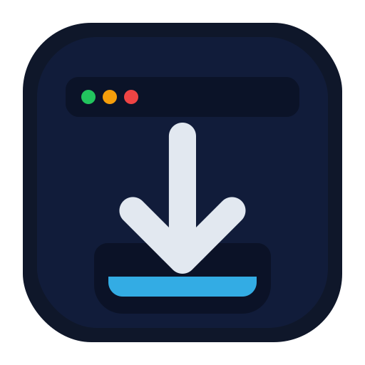

<div align="center">
  

  # HiAni DL

  ### Docker & Unraid Media Downloader with Web Interface

  
  
  

  **Download anime from HiAnime.to and media from social platforms**
  **Now with a modern web interface for easy management**

</div>

---

## 📖 Overview

HiAni DL is a powerful anime downloader designed for **local network (LAN) use** on Docker and Unraid environments. It provides both a command-line interface and a modern web-based GUI for downloading anime content from HiAnime.to.

> 🏠 **Designed for Home/LAN Use Only**
>
> This application is intended for **private, internal network deployment only**. It should **never be exposed directly to the internet (WAN)** without proper security measures like a reverse proxy with HTTPS, strong authentication, and rate limiting.

**Key Features:**
- 🌐 **Web Interface** - Modern Bootstrap UI for managing downloads
- 🐳 **Docker-Ready** - Fully containerized with Chrome and ffmpeg included
- 🏠 **LAN-Optimized** - Designed for trusted home/internal networks
- 📊 **Real-time Progress** - Live logs and progress tracking via Server-Sent Events
- 🎯 **Background Processing** - Downloads continue after closing browser
- 🎬 **Anime Downloads** - Full support for HiAnime.to (episodes, seasons, ranges)
- 🔧 **Unraid Support** - PUID/PGID mapping and community app integration

> ⚠️ **Warning:**
> This project currently contains **known issues** that are being investigated.
> Some downloads may fail (e.g., `.m3u8` streams not detected correctly) or Chrome sessions may not start reliably.
> Please check the Issues tab or follow project updates before using in production.

---

## 📜 Origin

This project is a **disconnected fork** of [HianimeDownloader](https://github.com/gheatherington/HianimeDownloader) by gheatherington. While it started from that codebase, this fork has diverged significantly with the addition of Docker support, WebGUI, Unraid integration, and extensive refactoring.

---

## 🚀 Quick Start

### WebGUI (Recommended)

```bash
# Clone the repository
git clone https://github.com/benjaminmue/Docker_Unraid_HianimeDownloader.git
cd Docker_Unraid_HianimeDownloader

# Start the web interface
./webgui-start.sh

# Access at http://localhost:8080
```

### CLI Mode

```bash
# Use docker-compose
docker-compose up -d hianime-cli

# Or run directly
./docker-start.sh
```

### 🏠 LAN/Home Network Configuration

**For trusted home networks, you can use relaxed security settings:**

```bash
# Option 1: Allow all URLs (no allowlist)
docker-compose up -d hianime-webgui
# Access at http://localhost:8080 or http://<your-lan-ip>:8080

# Option 2: Set specific allowed domains
docker run -e URL_ALLOWLIST="hianime.to" ...

# Option 3: Add authentication (optional for home use)
docker run -e WEB_USER=admin -e WEB_PASSWORD=yourpass ...
```

**Recommended for home/LAN:**
- ✅ Leave `URL_ALLOWLIST` empty or set to domains you use
- ⚠️ Skip `WEB_USER`/`WEB_PASSWORD` if only your family uses it
- ✅ Access via `http://192.168.x.x:8080` (no HTTPS needed on LAN)
- ⚠️ **Never expose port 8080 directly to the internet**

---

## 🌐 WebGUI (New!)

HiAni DL now includes a web interface for easier download management:

```bash
# Quick start
./webgui-start.sh

# Or manually with docker-compose
docker-compose up -d hianime-webgui

# Access at http://localhost:8080
```

**Key Features:**
- 📝 Submit downloads via web form
- 📊 Monitor progress with live updates (Server-Sent Events)
- 📜 View job history and detailed logs
- ❌ Cancel running jobs
- 📦 Download diagnostics bundles

**Security Features:**

*For LAN/home use, most security features can be relaxed:*
- ✅ **Essential (always enabled):**
  - Command injection prevention
  - SQL injection prevention
  - Path traversal protection
  - Input validation
- ⚙️ **Optional (configurable for LAN):**
  - URL allowlist - Set to `*` or specific domains you trust
  - Basic authentication - Skip if only trusted family members have access
  - SSRF protection - Less critical on isolated home networks

📖 **Documentation:**
- **[Full WebGUI Guide](WEBGUI.md)** - Setup and usage
- **[Optional Arguments Reference](ARGS.md)** - Available command-line arguments
- **[Docker Environment Variables](DOCKER.md)** - Complete list of configuration options
- **[Security Documentation](SECURITY.md)** - Security features and deployment guidance

---

## 🧰 Requirements (if running without Docker)

- Python 3.10+ and `pip`
- Google Chrome installed
- Optional: VPN with ad-blocking (to prevent redirect ads)
- Dependencies from `requirements.txt`

### Setup (Manual / Local)
```bash
git clone https://github.com/benjaminmue/Docker_Unraid_HianimeDownloader.git
cd Docker_Unraid_HianimeDownloader
pip install -r requirements.txt
python3 main.py
