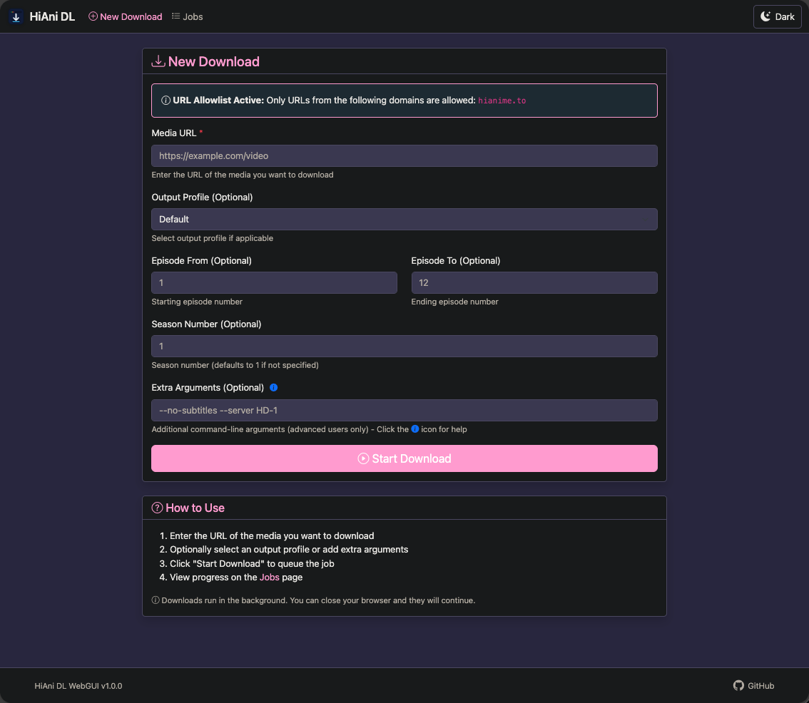
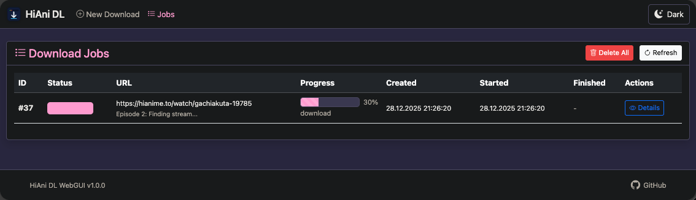
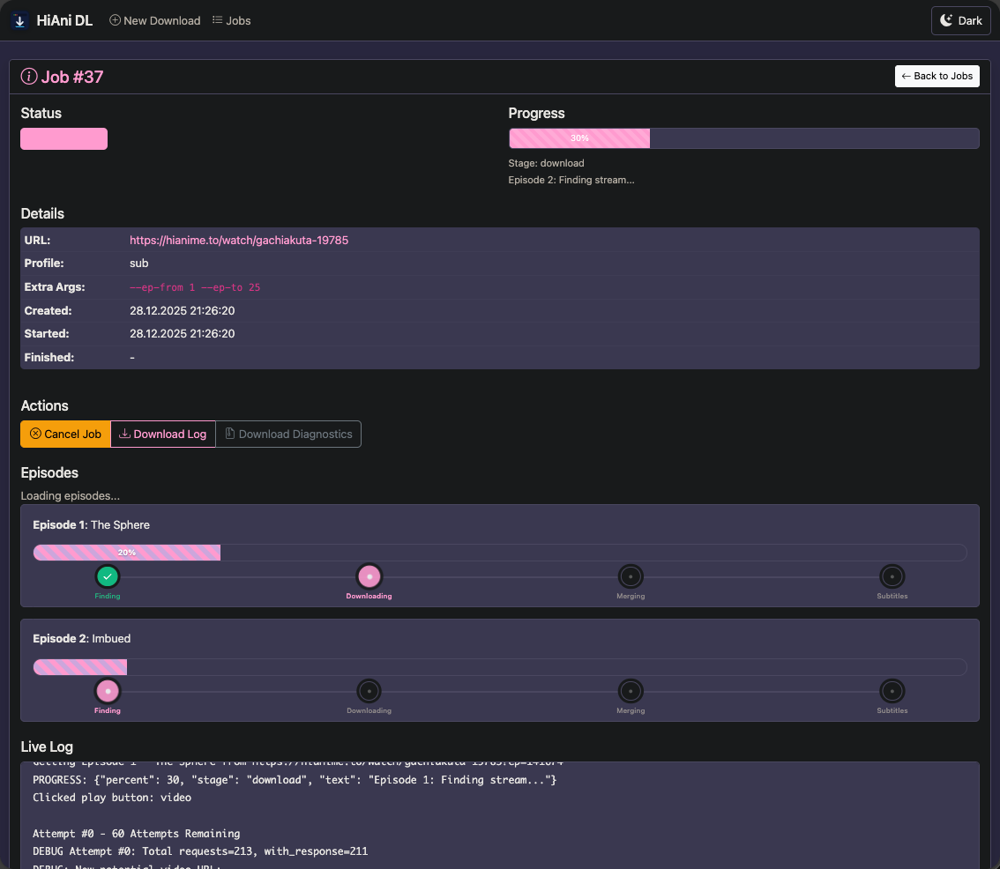

# <span style="color: #FF9BCF">User Guide</span>

Complete guide to using HiAni DL for downloading anime from HiAnime.to.

---

## Table of Contents

- [Getting Started](#getting-started)
- [Selecting URLs](#selecting-urls)
- [Download Options](#download-options)
- [Managing Jobs](#managing-jobs)
- [Troubleshooting](#troubleshooting)

---

## <span style="color: #FF9BCF">Getting Started</span>

### Accessing the WebGUI

**The WebGUI starts automatically when you run the container - no additional steps needed!**

1. Start HiAni DL:
   ```bash
   docker-compose up -d
   ```

   The WebGUI launches automatically and is immediately available.

2. Open your browser and navigate to:
   - Local: `http://localhost:8080`
   - LAN: `http://192.168.x.x:8080` (replace with your server's IP)

3. You should see the main download form with a dark theme inspired by HiAnime.to



> 💡 **Note:** No scripts or additional commands needed - `docker-compose up -d` automatically starts the WebGUI.

---

## <span style="color: #FF9BCF">Selecting URLs</span>

HiAni DL supports two types of URLs from HiAnime.to:

### URL Format 1: Series URL (Recommended for Multiple Episodes)

```
https://hianime.to/watch/gachiakuta-19785
```

**Best for:**
- Downloading entire seasons
- Episode ranges (e.g., episodes 1-12)
- Batch downloads

**Example:**
```
URL: https://hianime.to/watch/gachiakuta-19785
Episode From: 1
Episode To: 12
```

This will download episodes 1 through 12 of the series.

### URL Format 2: Episode-Specific URL (Recommended for Single Episodes)

```
https://hianime.to/watch/gachiakuta-19785?ep=141674
```

**Best for:**
- Downloading a specific single episode
- When you know the exact episode ID

**Example:**
```
URL: https://hianime.to/watch/gachiakuta-19785?ep=141674
```

This will download only the specific episode (141674).

### How to Find URLs

1. **Navigate to HiAnime.to**
   - Go to https://hianime.to
   - Search for your anime

2. **For Series URL:**
   - Click on the anime title
   - Copy the URL from your browser's address bar
   - It should look like: `https://hianime.to/watch/anime-name-12345`

3. **For Episode-Specific URL:**
   - Click on a specific episode
   - Copy the URL from your browser's address bar
   - It should look like: `https://hianime.to/watch/anime-name-12345?ep=67890`

### Which URL Format Should I Use?

| Scenario | Recommended Format | Example |
|----------|-------------------|---------|
| **Downloading multiple episodes** | Series URL | `https://hianime.to/watch/gachiakuta-19785` |
| **Downloading entire season** | Series URL | `https://hianime.to/watch/gachiakuta-19785` |
| **Downloading single episode** | Episode-specific URL | `https://hianime.to/watch/gachiakuta-19785?ep=141674` |
| **Unsure / First time** | Series URL | `https://hianime.to/watch/gachiakuta-19785` |

> 💡 **Tip:** Both formats work fine, but using the series URL with episode range is more flexible and recommended for most use cases.

---

## <span style="color: #FF9BCF">Download Options</span>

### Basic Options


#### 1. Media URL (Required)
Paste the HiAnime.to URL (see [Selecting URLs](#selecting-urls) above).

#### 2. Output Profile (Optional)
- **Default**: Automatically detect
- **Subtitle (sub)**: Prefer subtitled versions
- **Dubbed (dub)**: Prefer dubbed versions

#### 3. Episode Range (Optional)
- **Episode From**: Starting episode number (e.g., 1)
- **Episode To**: Ending episode number (e.g., 12)
- Leave blank to download all available episodes

#### 4. Season Number (Optional)
- Specify the season number if the series has multiple seasons
- Defaults to 1 if not specified

#### 5. Extra Arguments (Advanced)
- Additional command-line arguments for advanced users
- See [Arguments Reference](ARGS.md) for available options
- Click the info icon (ℹ️) for quick help

### Common Download Scenarios

#### Scenario 1: Download Entire Season
```
URL: https://hianime.to/watch/frieren-beyond-journeys-end-18542
Episode From: 1
Episode To: 28
Season: 1
Profile: Subtitle
```

#### Scenario 2: Download Specific Episodes
```
URL: https://hianime.to/watch/frieren-beyond-journeys-end-18542
Episode From: 5
Episode To: 10
```

#### Scenario 3: Download Single Episode (Method 1)
```
URL: https://hianime.to/watch/frieren-beyond-journeys-end-18542
Episode From: 7
Episode To: 7
```

#### Scenario 4: Download Single Episode (Method 2)
```
URL: https://hianime.to/watch/frieren-beyond-journeys-end-18542?ep=125678
```

#### Scenario 5: Download with Custom Server
```
URL: https://hianime.to/watch/frieren-beyond-journeys-end-18542
Episode From: 1
Episode To: 12
Extra Args: --server HD-1
```

---

## <span style="color: #FF9BCF">Managing Jobs</span>

### Viewing Jobs

Navigate to the "Jobs" page to see all download jobs:



**Job Statuses:**
- 🔵 **Queued**: Waiting to start
- 🔄 **Running**: Currently downloading
- ✅ **Success**: Completed successfully
- ❌ **Failed**: Download failed (click for details)
- ⚠️ **Canceled**: Manually canceled

### Job Details

Click "Details" on any job to see:
- Real-time progress updates
- Download logs
- Error messages (if failed)
- File output location



### Canceling Jobs

1. Navigate to the Jobs page
2. Find the running job
3. Click the "Cancel" button (only available for running jobs)
4. Confirm the cancellation

> ⚠️ **Note:** Canceling a job stops the download immediately but may leave partial files.

### Deleting Jobs

1. Navigate to Jobs page
2. Click "Delete All" to remove all completed/failed/canceled jobs
3. Running jobs cannot be deleted (cancel them first)

---

## <span style="color: #FF9BCF">Advanced Features</span>

### Extra Arguments

Click the info icon (ℹ️) in the Extra Arguments field to see available options.

**Common Options:**

| Argument | Description | Example |
|----------|-------------|---------|
| `--no-subtitles` | Skip subtitle download | `--no-subtitles` |
| `--server HD-1` | Use specific server | `--server HD-1` |
| `--filename "My Anime"` | Custom output name | `--filename "Frieren S01"` |

> 💡 **Note:** `aria2c` is already enabled by default for faster downloads.

See the full [Arguments Reference](ARGS.md) for all available options.

### Server Selection

If downloads fail, try a different server:

```
--server HD-1
--server HD-2
--server Vidstreaming
```

Add this to the "Extra Arguments" field.

---

## <span style="color: #FF9BCF">Troubleshooting</span>

### Common Issues

#### Issue: Download Fails Immediately

**Possible Causes:**
- Invalid URL
- Episode not available
- Server issues

**Solutions:**
1. Verify the URL is correct and accessible in your browser
2. Try a different server using `--server HD-2`
3. Check the job logs for specific error messages

#### Issue: Progress Stuck at 0%

**Possible Causes:**
- Chrome driver issue
- Network connectivity

**Solutions:**
1. Check Docker logs: `docker-compose logs hianime-webgui`
2. Restart the container: `docker-compose restart hianime-webgui`
3. Try with a different anime to isolate the issue

#### Issue: "URL not allowed" Error

**Cause:**
URL allowlist is enabled and the domain is not permitted.

**Solution:**
Update `URL_ALLOWLIST` environment variable:
```yaml
environment:
  URL_ALLOWLIST: "hianime.to"
```

See [Docker Setup](DOCKER.md) for details.

#### Issue: Files Not Appearing

**Possible Causes:**
- Volume mount incorrect
- Permission issues

**Solutions:**
1. Check volume mount in `docker-compose.yml`
2. Verify PUID/PGID settings match your user
3. Check container logs for permission errors

### Getting Help

If you encounter issues:

1. **Check Logs:**
   ```bash
   docker-compose logs -f hianime-webgui
   ```

2. **Job Details:**
   - Click "Details" on the failed job
   - Review error messages and logs

3. **Report Issues:**
   - [GitHub Issues](https://github.com/benjaminmue/HiAni-DL/issues)
   - Include logs and job details
   - Describe steps to reproduce

---

## <span style="color: #FF9BCF">Best Practices</span>

### For Reliable Downloads

1. **Use Series URLs** for episode ranges
2. **Test with single episode** before downloading full seasons
3. **Monitor first few episodes** to ensure quality/format is correct
4. **Use default server** first, switch only if issues occur
5. **Check disk space** before large downloads

### For Performance

1. **aria2c is enabled by default** - no need to add it
2. **Limit concurrent jobs** - run 1-2 at a time for best performance
3. **Use wired connection** if possible for stability
4. **Avoid VPN** if not necessary (can slow downloads)

### For Organization

1. **Use descriptive filenames** with `--filename` argument
2. **Organize by season** using season number
3. **Clean up failed jobs** regularly to keep job list manageable
4. **Download to separate folders** per series (configure in Docker volumes)

---

## <span style="color: #FF9BCF">Next Steps</span>

- **[Docker Configuration](DOCKER.md)** - Customize environment variables and volumes
- **[WebGUI Guide](WEBGUI.md)** - Detailed WebGUI features and API
- **[Arguments Reference](ARGS.md)** - All command-line options
- **[Security Guide](SECURITY.md)** - Secure your deployment

---

<div align="center">

**Need more help?** [Open an issue](https://github.com/benjaminmue/HiAni-DL/issues) or check the [documentation](../README.md)

</div>
